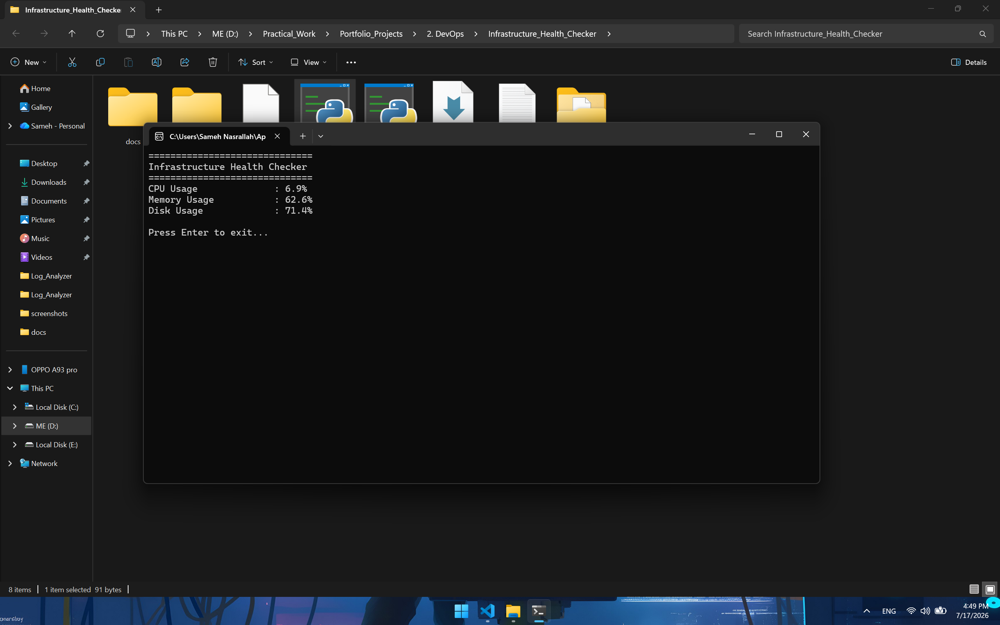
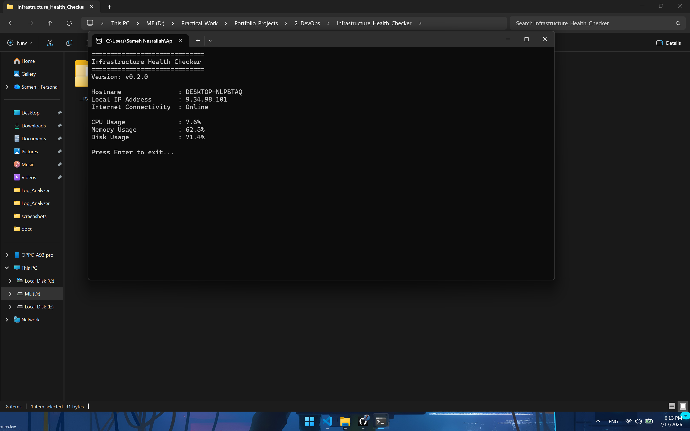
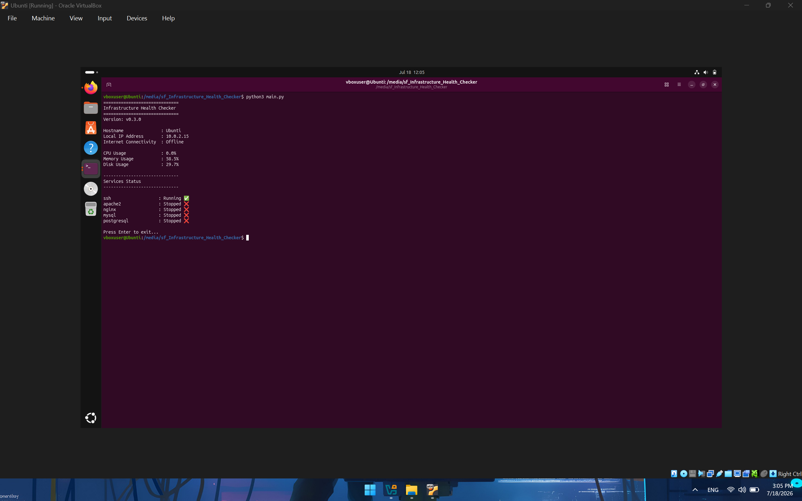
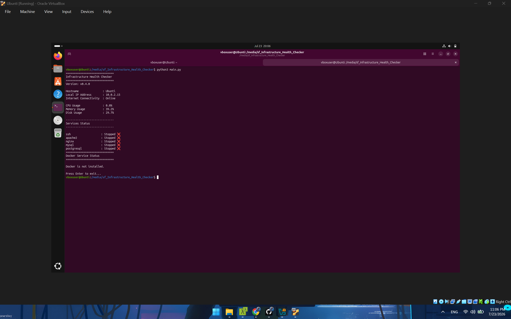
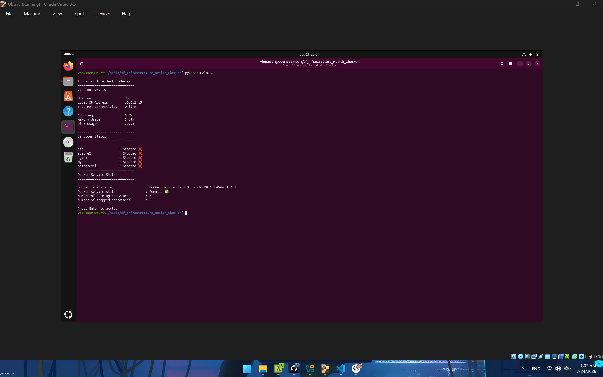
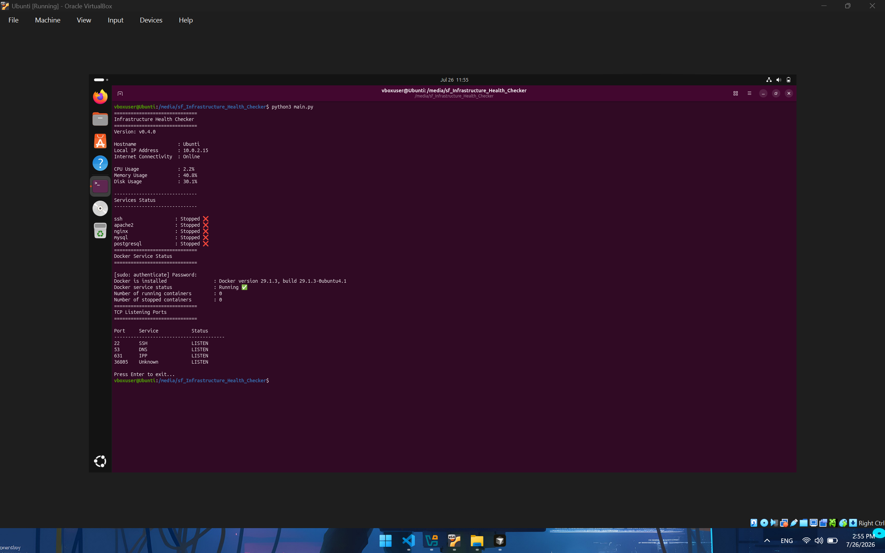
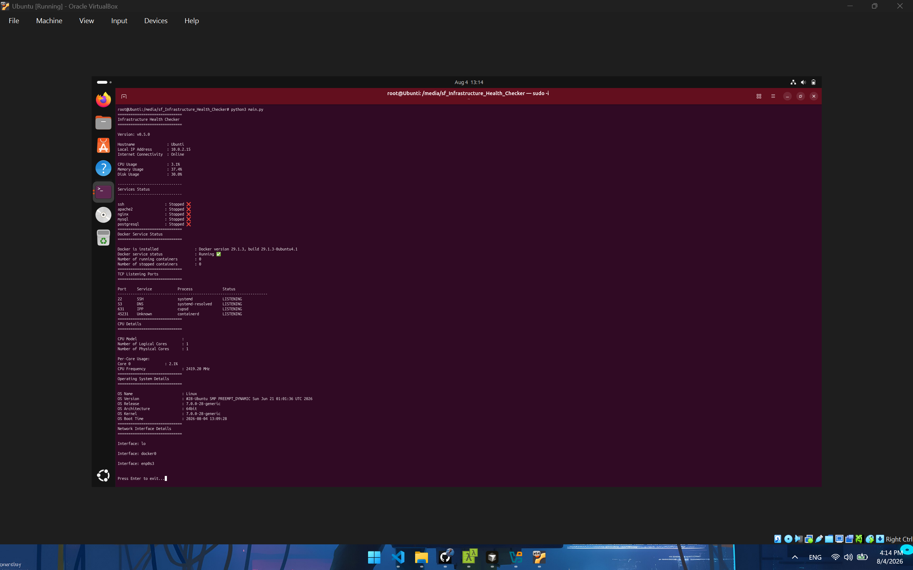

# Infrastructure Health Checker

A Python-based infrastructure monitoring tool that analyzes system health, resource usage, and generates health reports for Linux servers.

---

## Overview

Infrastructure Health Checker is a lightweight monitoring application designed to provide quick insights into health of a Linux server.
The projects is being developed incrementally using Agile Sprints to simulate a real-world software development lifecycle.

---

## 🚀 Features 

### Sprint 1

- CPU Usage Monitoring
- RAM Usage Monitoring
- Disk Usage Monitoring 
- Clean Console Report

### Sprint 2

- Hostname detection
- Local IP Address Detection
- Internet Connectivity Check
- Improved Console Output
- Version Information Display

### Sprint 3

- Linux Server Monitoring
- SSH Service Status
- Apache Service Status
- Nginx Service Status
- MYSQL Service Status
- PostgreSQL Service Status
- Service Status Mapping (Running / Stopped / Failed / Not Installed)

### Sprint 4

- Docker Installation Detection
- Docker Service Status
- Running Containers Counter
- Stopped Containers Counter

### Sprint 5

- TCP Listening Ports Detection
- Common Service Mapping 
- Professional Ports Report
- Duplicate Port Filtering
- Sorted Port Display 

### Sprint 6

- CPU Details
- Logical & Physical CPU Detection
- Per-Core CPU Usage
- CPU Frequency Information
- Operating System Details
- System Boot Time
- Network Interface Details
- Process Name Detection
- Port Owner Information
- Reusable Header Function

---

## 🛠️ Technologies

- Python
- psutil
- platform
- socket
- subprocess

---

## 📁 Project Structure

```text
Infrastructure_Health-Checker/
│
├── main.py
├── monitor.py
├── screenshots/
├── docs/
├── README.md
├── requirements.txt
└── .gitignore
```

---

## Screenshots

### Sprint 1



### Sprint 2



### Sprint 3



### Sprint 4




### Sprint 5



### Sprint 6



---

## 📌 Roadmap 

### Sprint 7

- Memory Details
- Memory Usage Breakdown
- Available & Used Memory
- Swap Memory Information

### Future

- JSON Reports
- HTML Dashboard
- SSH Remote Monitoring
- Multi-server Monitoring
- Health Score
- Configuration File Support

---

## 📊 Current Version

**v0.6.0**
